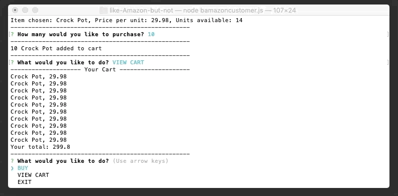

# like-Amazon-but-not
Using MSQL, Node.js and Inquirer

## Assignment
* Create a Node App that connects to MySQL database
* Use Inquirer to step through app functionality
* The Customer app should be able to:
    1. Browse products
    1. Place products in cart
    1. View cart
* The Manager app should be able to:
    1. View Products for Sale
    1. View Low Inventory
    1. Add to Inventory
    1. Add New Product

## Technologies Used
* Node.js
* JavaScript
* Inquirer
* MySQL

## Demo Time!

### Customer App
To see that this app is working, let's look at our database first:  


As soon as the user calls the app, 3 options are shown: BUY, VIEW CART or EXIT.  
```bash
node bAmazonCustomer.js
```  
  

If the user chooses to BUY, all available products are shown.  


The user can then scroll through and choose the product they wish to buy. When they hit enter, that item is added to their cart.  
  

The app automatically sends the user back to the start menu. If the user chooses to VIEW CART, what they just added will be shown with the collective total of their cart displayed.  
  

Looking back at our database, we can see that the stock quantity for crock pots was decreased! Yay! It works!  
  

And of course, the user can exit the app at any time.  
  

### Manager App

