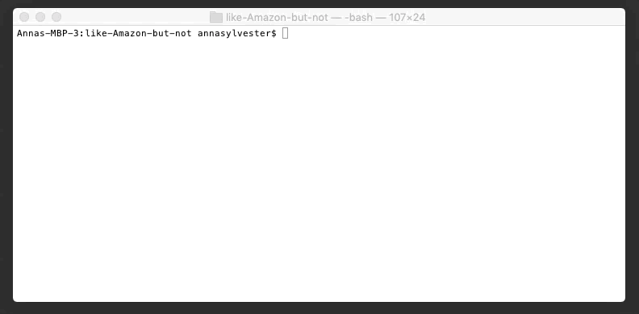
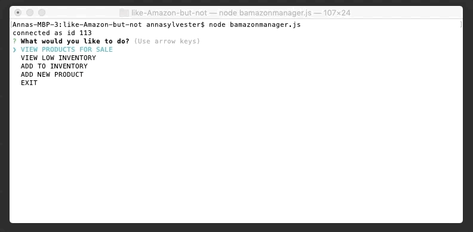
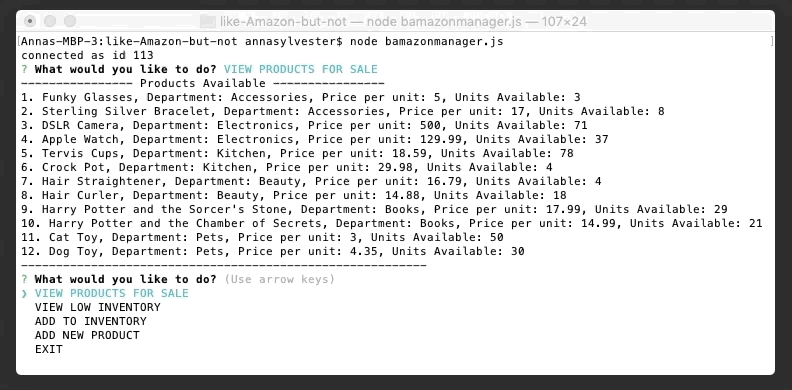
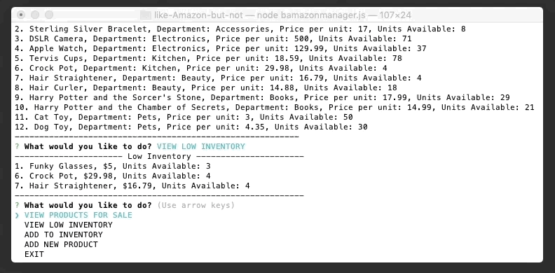
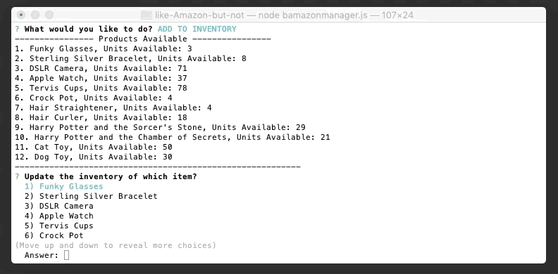
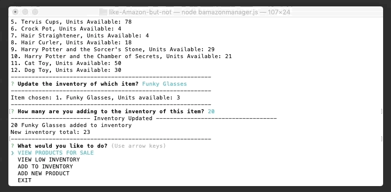
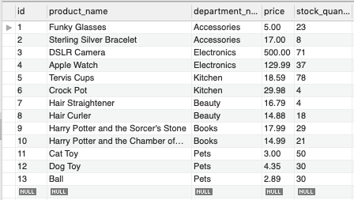
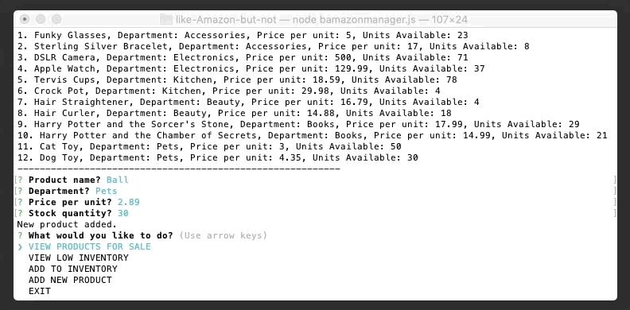

# like-Amazon-but-not
Using MSQL, Node.js and Inquirer

## Assignment
* Create a Node App that connects to MySQL database
* Use Inquirer to step through app functionality
* The Customer app should be able to:
    1. Browse products
    2. Place products in cart
    3. View cart
* The Manager app should be able to:
    1. View Products for Sale
    2. View Low Inventory
    3. Add to Inventory
    4. Add New Product

## Technologies Used
* Node.js
* JavaScript
* Inquirer
* MySQL

## Demo Time!

### Customer App
To see that this app is working, let's look at our database first. (Keep an eye on the crock pot...)   

  
To call the app:
```bash
node bAmazonCustomer.js
```  
As soon as the user calls the app, 3 options are shown: BUY, VIEW CART or EXIT.  

  

If the user chooses to **BUY**, all available products are shown.  


The user can then scroll through and choose the product they wish to buy. When they hit enter, that item is added to their cart.  
  

The app automatically sends the user back to the start menu. If the user chooses to **VIEW CART**, what they just added will be shown with the collective total of their cart displayed.  
  

Looking back at our database, we can see that the stock quantity for crock pots was decreased! Yay! It works!  
  

And of course, the user can exit the app at any time.  
  

### Manager App
To see that this app is working, let's look at our database first.    

  
To call the app:
```bash
node bAmazonCustomer.js
```  
As soon as the user calls the app, 5 options are shown: VIEW PRODUCTS FOR SALE, VIEW LOW INVENTORY, ADD TO INVENTORY, ADD NEW PRODUCT or EXIT.  
  

If the user chooses to **VIEW PRODUCTS FOR SALE**, all available products are shown.  


If the user chooses to **VIEW LOW INVENTORY**, all items with inventory below 5 are shown. 
  

If the user chooses to **ADD TO INVENTORY**, the user can scroll through the available products with their respective stock quantities and choose the one they would like to add inventory to.
  

The user is then asked to input how many units they are adding. Here, we chose to update Funky Glasses with 20 units.  
  

If the user chooses to **ADD NEW PRODUCT**, the available products are again displayed.  
  

The user can then input the name, department, price per unit and stock quantity of the product they are adding. Here we chose to add a ball in the pets department.  
   

Looking back at our database, we can see that the stock quantity for Funky Glasses was increased by 20 and the new ball was added. Yay! It works!  
  

And of course, the user can exit the app at any time.  
  

